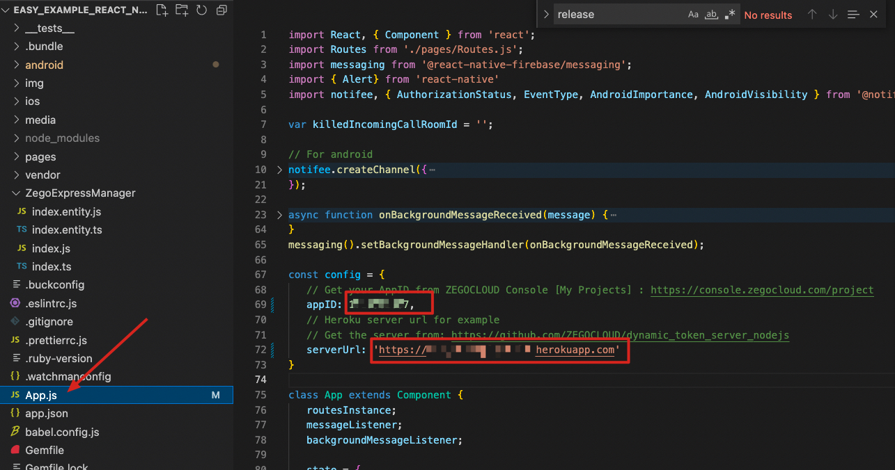
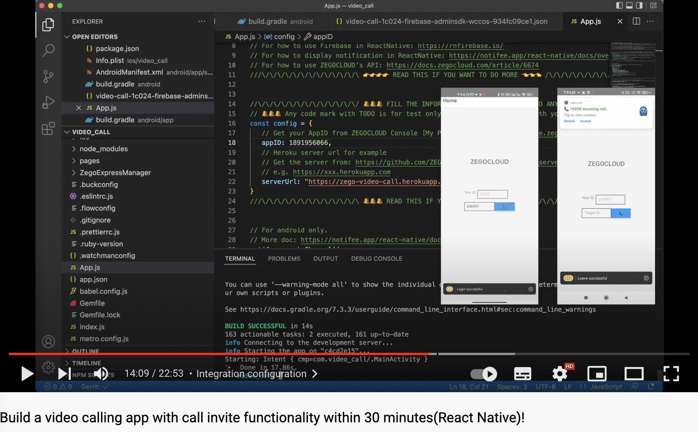
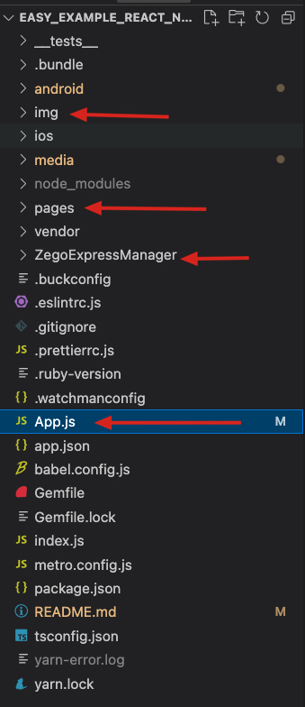
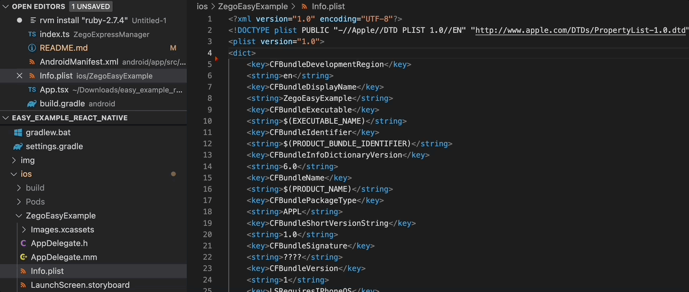
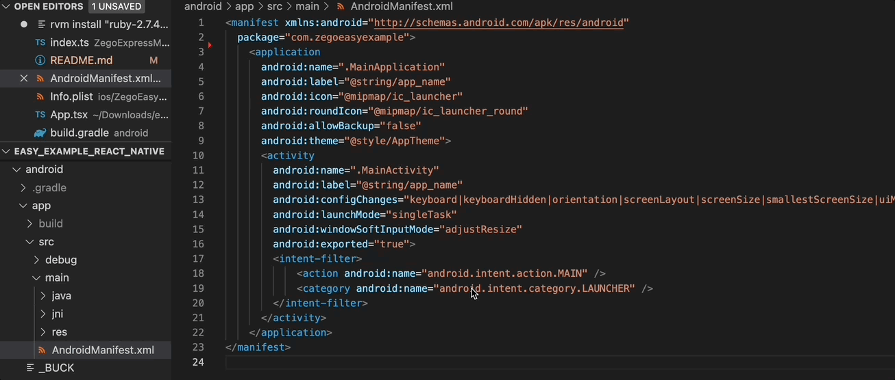
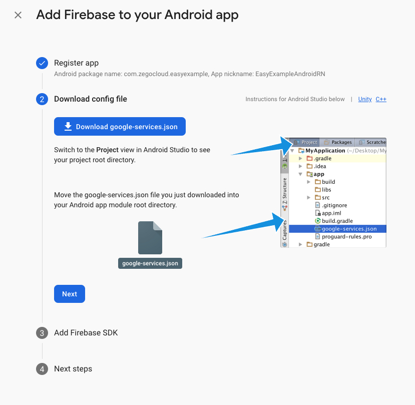
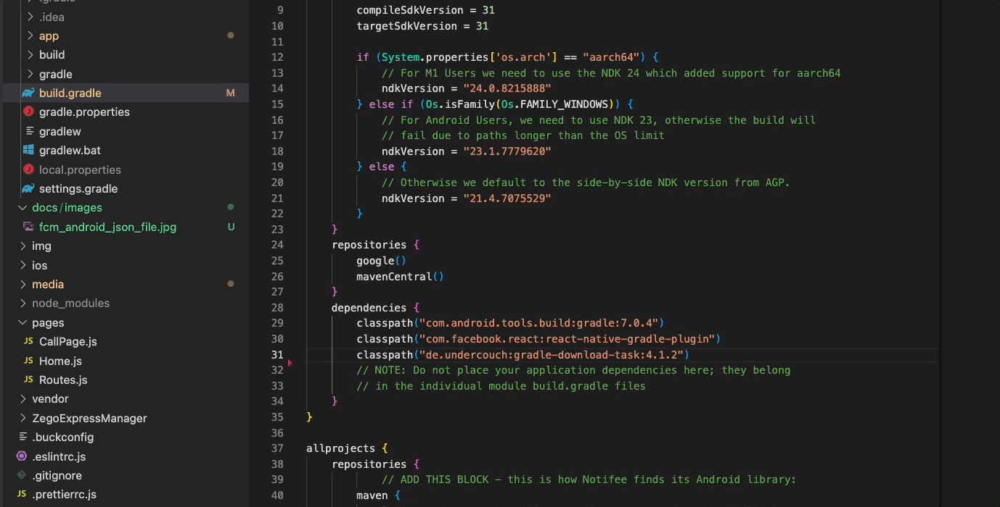
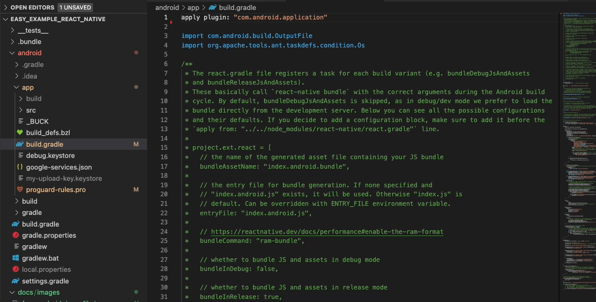
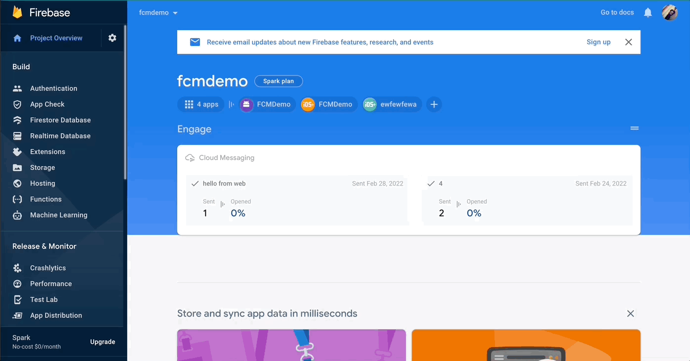

# ZEGOCLOUD easy example
<p align="center">
    <a href="https://github.com/ZEGOCLOUD/easy_example_react_native/releases"></a>
    <a href="https://discord.gg/EtNRATttyp">
        
    </a>
    <p>
    <p>Click the search button below to search documentation or error code</p>
    <a href="https://docs.zegocloud.com/">
        
    </a>
    </p>
</p>

ZEGOCLOUD's easy example is a simple wrapper around our RTC product. You can refer to the sample code for quick integration.

## Getting started

The following will describe how to start this project.

### Prerequisites

#### Basic requirements

* Refer to the [React Native website](https://reactnative.dev/docs/environment-setup) to configure the development environment.
* Create a project in [ZEGOCLOUD Admin Console](https://console.zegocloud.com/). For details, see [ZEGO Admin Console - Project management](https://docs.zegocloud.com/article/1271).

#### To build an Android app:

* Android SDK packages: Android SDK 30, Android SDK Platform-Tools 30.x.x or later.
* An Android device or Simulator that is running on Android 4.1 or later and supports audio and video. We recommend you use a real device (Remember to enable **USB debugging** for the device).

#### To build an iOS app:

* [Xcode 7.0 or later](https://developer.apple.com/xcode/download)
* [CocoaPods](https://guides.cocoapods.org/using/getting-started.html#installation)
* An iOS device or Simulator that is running on iOS 13.0 or later and supports audio and video. We recommend you use a real device.

### Run the sample code

Clone the easy example Github repository.

#### Install dependencies

1. Open Terminal, navigate to the `easy_example_react_native` folder.
2. Run the `yarn install` command to install all dependencies that are needed.

#### Modify the project configurations

* You need to set `appID` to your own account, which can be obtained in the [ZEGO Admin Console](https://console.zegocloud.com/).
* You need to set `serverUrl` to a valid URL that can be obtained for Zego auth token and post FCM notification request.

> We use Heroku for test backen service, you can deploy the token generation service with one simple click.
>
> [](https://heroku.com/deploy?template=https://github.com/ZEGOCLOUD/easy_example_call_server_nodejs)
>
> Once deployed completed, you will get an url for your instance, try accessing `https://<heroku url>/access_token?uid=1234` to check if it works.
> 
> Check [easy_example_call_server_nodejs](https://github.com/ZEGOCLOUD/easy_example_call_server_nodejs) for more details.
> 
> Note⚠️⚠️⚠️: There are some limitations for Heroku free account, please check this [Free Dyno Hours](https://devcenter.heroku.com/articles/free-dyno-hours) if you want to use Heroku for your production service.


> 

#### Run on your device
1. For Android

```ssh
$ yarn android
```

2. For iOS

> **⚠️⚠️⚠️Ruby Version**
>
> For running on iOS device, please check if your ruby version is compatible with the `Gemfile`. If not, do the following steps:
>
> 1. Install rvm: https://rvm.io/
> 2. Install ruby 2.7.4 and use it
>```bash
>$ rvm install 2.7.4
>$ rvm use 2.7.4
>```
>3. Install cocoapods with gem
>```bash
>$ gem install cocoapods
>```
>4. Run pod install under `easy_example_react_native/ios`
>```bash
>pod install
>```
> **⚠️⚠️⚠️Signing**
>
> You need to open `ZegoEasyExample.xcworkspace` with `XCode` on the first time build.
> Then select a development team in the Signing & Capabilities editor.

When all the configuration is ready, run:
```bash
$ yarn ios
```

## Integrate the SDK into your own project

[](https://www.youtube.com/watch?v=ABi11TGua3s)
The following will describe how to build your own project based on this project.

### Copy the source code

Copy the `ZegoExpressManager` folder, `img` folder, `pages` folder and `App.js` files to your project.

> 

### Add dependencies to `package.json`

```json
"dependencies": {
    ...
    "react-native-reanimated": "^2.8.0",
    "react-native-safe-area-context": "^4.2.5",
    "react-native-gesture-handler": "^2.4.2",
    "react-native-screens": "^3.13.1",
    "@notifee/react-native": "^5.2.1",
    "@react-native-firebase/app": "^14.9.2",
    "@react-native-firebase/messaging": "^14.9.2",
    "notifee": "^0.0.1",
    "react-native-router-flux": "^4.3.1",
    "zego-express-engine-reactnative": "^0.17.3",
}
```
### Grant permission

You need to grant the network access, camera, microphone and notification permission to make your APP work as except.

#### For iOS
> 
```plist
<key>NSCameraUsageDescription</key>
<string>We need to use your camera to help you join the voice interaction.</string>
<key>NSMicrophoneUsageDescription</key>
<string>We need to use your mic to help you join the voice interaction.</string>
```

#### For Android
> 
```xml
<!-- Permissions required by the SDK --> 

<uses-permission android:name="android.permission.ACCESS_WIFI_STATE" />
<uses-permission android:name="android.permission.RECORD_AUDIO" />
<uses-permission android:name="android.permission.INTERNET" />
<uses-permission android:name="android.permission.ACCESS_NETWORK_STATE" />
<uses-permission android:name="android.permission.CAMERA" />
<uses-permission android:name="android.permission.BLUETOOTH" />
<uses-permission android:name="android.permission.MODIFY_AUDIO_SETTINGS" />
<uses-permission android:name="android.permission.WRITE_EXTERNAL_STORAGE" />

<!-- Permissions required by the App -->

<uses-permission android:name="android.permission.READ_PHONE_STATE" />
<uses-permission android:name="android.permission.WAKE_LOCK" />
<uses-feature android:glEsVersion="0x00020000"  android:required="true" />
<uses-feature android:name="android.hardware.camera" />
<uses-feature android:name="android.hardware.camera.autofocus" />

<!-- Permissions required by notification -->
<application
  ...
  <activity
    android:showWhenLocked="true"
    android:turnScreenOn="true"
    ...
```

### Setup FCM and notification(Android)

We use [Firebase FCM](https://firebase.google.com/docs/cloud-messaging) for notification service and use [Notifee](https://notifee.app/) to display the notification content.

#### Setup FCM

1. Go to [Firebase Console](https://console.firebase.google.com/) and create new project if you don't have one.
2. Andd new `Android` app to your Firebase project. Download the `google-service.json` file and  move it into your Android app module root directory.

3.  Add the google-services plugin as a dependency inside of your `/android/build.gradle` file:

```xml
buildscript {
  dependencies {
    // ... other dependencies
    classpath 'com.google.gms:google-services:4.3.10'
    // Add me --- /\
  }
}
```
4. Execute the plugin by adding the following to your `/android/app/build.gradle` file:

```xml
apply plugin: 'com.android.application'
apply plugin: 'com.google.gms.google-services' // <- Add this line
```

#### Setup Notifee

1. Add libs configuration for Notifee to your `/android/build.gradle` file:
```xml
allprojects {
    repositories {
        // ADD THIS BLOCK - this is how Notifee finds its Android library:
        maven {
          url "$rootDir/../node_modules/@notifee/react-native/android/libs"
        }
```
2. Add custom notification sound `call_invite.mp3` into `/android/app/src/main/res/raw/call_invite.mp3`.
> Note⚠️⚠️⚠️: custom notification sound only support `.mp3` file on Android platform

#### Setup backend service
1. Generate `Firebase Admin SDK Private Key`


2. Click this deploy button to start deploy your service:

[](https://heroku.com/deploy?template=https://github.com/ZEGOCLOUD/easy_example_call_server_nodejs)

If you are using [Firebase Cloud Functions](https://firebase.google.com/docs/functions), check [this doc](https://firebase.google.com/docs/cloud-messaging/send-message#send-messages-to-specific-devices) for usage and check [this example code](https://github.com/ZEGOCLOUD/easy_example_call_server_nodejs/blob/master/index.js) to make the FCM work with your project.


### Method call

The calling sequence of the SDK interface is as follows:
createEngine --> onRoomUserUpdate、onRoomUserDeviceUpdate、onRoomTokenWillExpire --> joinRoom --> setLocalVideoView/setRemoteVideoView --> leaveRoom

#### Create engine

Before using any method of the SDK, you need to create an engine instance first. We recommend creating it when the application starts. The sample code is as follows:

```typescript
const profile = {
    appID: config.appID,
    scenario: ZegoScenario.General,
} as ZegoEngineProfile;
ZegoExpressManager.instance().createEngine(profile);
```

#### Register related callbacks

You can get information in the relevant callbacks and do your own thing.

```typescript
ZegoExpressManager.instance().onRoomUserUpdate((updateType, userList, roomID) => {
    // Do something...
});
ZegoExpressManager.instance().onRoomUserDeviceUpdate((updateType, userID, roomID) => {
    // Do something...
});
ZegoExpressManager.instance().onRoomTokenWillExpire((roomID, remainTimeInSecond) => {
    // Do something...
});
```

#### Join room

When you want to communicate with audio and video, you need to call the join room interface first. According to your business scenario, you can set different audio and video controls through options, such as:

ZegoMediaOptions enumeration can be found in ZegoExpressManager/index.entity.ts.

1. call scene: [ZegoMediaOptions.AutoPlayVideo, ZegoMediaOptions.AutoPlayAudio, ZegoMediaOptions.PublishLocalAudio, ZegoMediaOptions.PublishLocalVideo], the default is this scenario
2. Live scene - host: [ZegoMediaOptions.AutoPlayVideo, ZegoMediaOptions.AutoPlayAudio, ZegoMediaOptions.PublishLocalAudio, ZegoMediaOptions.PublishLocalVideo]
3. Live scene - audience:[ZegoMediaOptions.AutoPlayVideo, ZegoMediaOptions.AutoPlayAudio]
4. Chat room - host: [ZegoMediaOptions.AutoPlayAudio, ZegoMediaOptions.PublishLocalAudio]
5. Chat room - audience: [ZegoMediaOptions.AutoPlayAudio]

The following sample code is an example of a call scenario, options can not be passed by default:

```typescript
ZegoExpressManager.instance().joinRoom(config.roomID, token, { userID: config.userID, userName: config.userName });
```

#### Set video view

If your project needs to use the video communication function, you need to set the View for displaying the video, call `setLocalVideoView` for the local video, and call `setRemoteVideoView` for the remote video.

**setLocalVideoView:**

```tsx
<ZegoTextureView ref={this.zegoPreviewViewRef}/>
```

```typescript
this.zegoPreviewViewRef = React.createRef();
ZegoExpressManager.instance().setLocalVideoView(findNodeHandle(this.zegoPreviewViewRef.current));
```

**setRemoteVideoView:**

```tsx
<ZegoTextureView ref={this.zegoPlayViewRef}/>
```

```typescript
ZegoExpressManager.instance().onRoomUserUpdate(
    (updateType: ZegoUpdateType, userList: string[], roomID: string) => {
        userList.forEach(userID => {
            if (updateType === ZegoUpdateType.Add) {
                ZegoExpressManager.instance().setRemoteVideoView(
                userID,
                findNodeHandle(this.zegoPlayViewRef.current));
            }
        });
    }
);
```

#### Leave room

When you want to leave the room, you can call the leaveroom interface.

```typescript
ZegoExpressManager.instance().leaveRoom();
```
