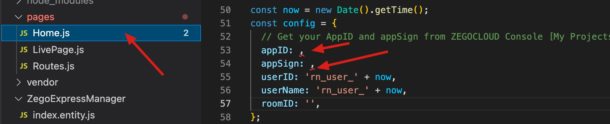

# ZEGOCLOUD easy example

ZEGOCLOUD's easy example is a simple wrapper around our RTC product. You can refer to the sample code for quick integration.

## Getting started

The following will describe how to start this project.

### Prerequisites

#### Basic requirements

* Refer to the [React Native website](https://reactnative.dev/docs/environment-setup) to configure the development environment.
* Create a project in [ZEGOCLOUD Admin Console](https://console.zegocloud.com/). For details, see [ZEGO Admin Console - Project management](https://docs.zegocloud.com/article/1271).

#### To build an Android app:

* Android SDK packages: Android SDK 30, Android SDK Platform-Tools 30.x.x or later.
* An Android device or Simulator that is running on Android 4.1 or later and supports audio and video. We recommend you use a real device (Remember to enable **USB debugging** for the device).

#### To build an iOS app:

* [Xcode 7.0 or later](https://developer.apple.com/xcode/download)
* [CocoaPods](https://guides.cocoapods.org/using/getting-started.html#installation)
* An iOS device or Simulator that is running on iOS 13.0 or later and supports audio and video. We recommend you use a real device.

### Run the sample code

Clone the easy example Github repository.

#### Install dependencies

1. Open Terminal, navigate to the `easy_example_react_native` folder.
2. Run the `yarn install` command to install all dependencies that are needed.

#### Modify the project configurations

* You need to modify `appID` to your own account, which can be obtained in the [ZEGO Admin Console](https://console.zegocloud.com/).
* [Generate a Token on your app server (recommended)](https://docs.zegocloud.com/article/11648), provide an interface for the client to call and replace the generateToken method above.

> If you are using Heroku for your backen service, you can deploy the token generation service by one click.
>
> [](https://heroku.com/deploy?template=https://github.com/ZEGOCLOUD/dynamic_token_server_nodejs)
>
> Once done you will get an url for your instance, try accessing `https://<heroku url>/access_token?uid=1234` to check if it works.
> 
> Check [dynamic_token_server_nodejs](https://github.com/ZEGOCLOUD/dynamic_token_server_nodejs) for more details.


> 

#### Run on your device
1. For Android

```ssh
$ yarn android
```

2. For iOS

> **⚠️⚠️⚠️Ruby Version**
>
> For running on iOS device, please check if your ruby version is compatible with the `Gemfile`. If not, do the following steps:
>
> 1. Install rvm: https://rvm.io/
> 2. Install ruby 2.7.4 and use it
>```bash
>$ rvm install 2.7.4
>$ rvm use 2.7.4
>```
>3. Install cocoapods with gem
>```bash
>$ gem install cocoapods
>```
>4. Run pod install under `easy_example_react_native/ios`
>```bash
>pod install
>```
> **⚠️⚠️⚠️Signing**
>
> You need to open `ZegoEasyExample.xcworkspace` with `XCode` on the first time build.
> Then select a development team in the Signing & Capabilities editor.

When all the configuration is ready, run:
```bash
$ yarn ios
```

## Integrate the SDK into your own project

The following will describe how to build your own project based on this project.

### Copy the source code

Copy the `ZegoExpressManager` folder、 `img` folder and `App.tsx` files to your typescript project.

> 

### Add dependencies to `package.json`

```json
"dependencies": {
    "zego-express-engine-reactnative": "^0.17.3"
}
```
### Grant permission

You need to grant the network access, camera, and microphone permission to make your APP work as except.

#### For iOS
> 
```plist
<key>NSCameraUsageDescription</key>
<string>We need to use your camera to help you join the voice interaction.</string>
<key>NSMicrophoneUsageDescription</key>
<string>We need to use your mic to help you join the voice interaction.</string>
```

#### For Android
> 
```xml
<!-- Permissions required by the SDK --> 

<uses-permission android:name="android.permission.ACCESS_WIFI_STATE" />
<uses-permission android:name="android.permission.RECORD_AUDIO" />
<uses-permission android:name="android.permission.INTERNET" />
<uses-permission android:name="android.permission.ACCESS_NETWORK_STATE" />
<uses-permission android:name="android.permission.CAMERA" />
<uses-permission android:name="android.permission.BLUETOOTH" />
<uses-permission android:name="android.permission.MODIFY_AUDIO_SETTINGS" />
<uses-permission android:name="android.permission.WRITE_EXTERNAL_STORAGE" />

<!-- Permissions required by the App -->

<uses-permission android:name="android.permission.READ_PHONE_STATE" />
<uses-permission android:name="android.permission.WAKE_LOCK" />
<uses-feature android:glEsVersion="0x00020000"  android:required="true" />
<uses-feature android:name="android.hardware.camera" />
<uses-feature android:name="android.hardware.camera.autofocus" />
```

### Method call

The calling sequence of the SDK interface is as follows:
createEngine --> onRoomUserUpdate、onRoomUserDeviceUpdate、onRoomTokenWillExpire --> joinRoom --> setLocalVideoView/setRemoteVideoView --> leaveRoom

#### Create engine

Before using any method of the SDK, you need to create an engine instance first. We recommend creating it when the application starts. The sample code is as follows:

```typescript
const profile = {
    appID: config.appID,
    scenario: ZegoScenario.General,
} as ZegoEngineProfile;
ZegoExpressManager.instance().createEngine(profile);
```

#### Register related callbacks

You can get information in the relevant callbacks and do your own thing.

```typescript
ZegoExpressManager.instance().onRoomUserUpdate((updateType, userList, roomID) => {
    // Do something...
});
ZegoExpressManager.instance().onRoomUserDeviceUpdate((updateType, userID, roomID) => {
    // Do something...
});
ZegoExpressManager.instance().onRoomTokenWillExpire((roomID, remainTimeInSecond) => {
    // Do something...
});
```

#### Join room

When you want to communicate with audio and video, you need to call the join room interface first. According to your business scenario, you can set different audio and video controls through options, such as:

ZegoMediaOptions enumeration can be found in ZegoExpressManager/index.entity.ts.

1. call scene: [ZegoMediaOptions.AutoPlayVideo, ZegoMediaOptions.AutoPlayAudio, ZegoMediaOptions.PublishLocalAudio, ZegoMediaOptions.PublishLocalVideo], the default is this scenario
2. Live scene - host: [ZegoMediaOptions.AutoPlayVideo, ZegoMediaOptions.AutoPlayAudio, ZegoMediaOptions.PublishLocalAudio, ZegoMediaOptions.PublishLocalVideo]
3. Live scene - audience:[ZegoMediaOptions.AutoPlayVideo, ZegoMediaOptions.AutoPlayAudio]
4. Chat room - host: [ZegoMediaOptions.AutoPlayAudio, ZegoMediaOptions.PublishLocalAudio]
5. Chat room - audience: [ZegoMediaOptions.AutoPlayAudio]

The following sample code is an example of a call scenario, options can not be passed by default:

```typescript
ZegoExpressManager.instance().joinRoom(config.roomID, token, { userID: config.userID, userName: config.userName });
```

#### Set video view

If your project needs to use the video communication function, you need to set the View for displaying the video, call `setLocalVideoView` for the local video, and call `setRemoteVideoView` for the remote video.

**setLocalVideoView:**

```tsx
<ZegoTextureView ref={this.zegoPreviewViewRef}/>
```

```typescript
this.zegoPreviewViewRef = React.createRef();
ZegoExpressManager.instance().setLocalVideoView(findNodeHandle(this.zegoPreviewViewRef.current));
```

**setRemoteVideoView:**

```tsx
<ZegoTextureView ref={this.zegoPlayViewRef}/>
```

```typescript
ZegoExpressManager.instance().onRoomUserUpdate(
    (updateType: ZegoUpdateType, userList: string[], roomID: string) => {
        userList.forEach(userID => {
            if (updateType === ZegoUpdateType.Add) {
                ZegoExpressManager.instance().setRemoteVideoView(
                userID,
                findNodeHandle(this.zegoPlayViewRef.current));
            }
        });
    }
);
```

#### Leave room

When you want to leave the room, you can call the leaveroom interface.

```typescript
ZegoExpressManager.instance().leaveRoom();
```
